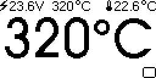
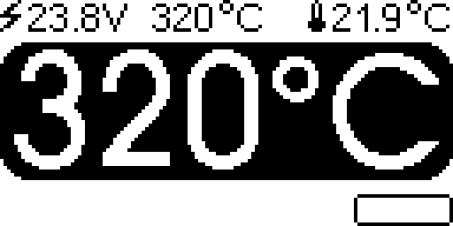
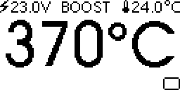
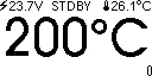
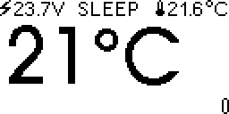
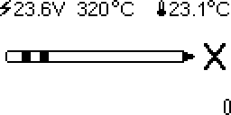
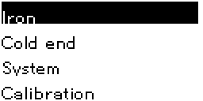
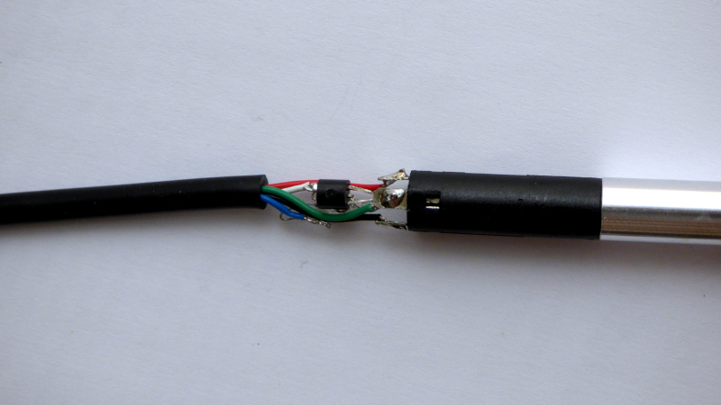
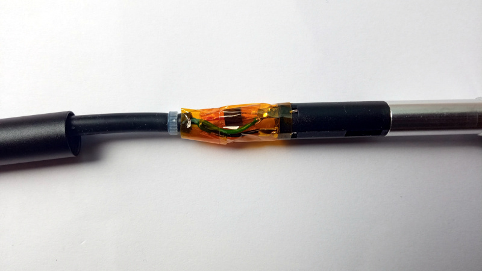
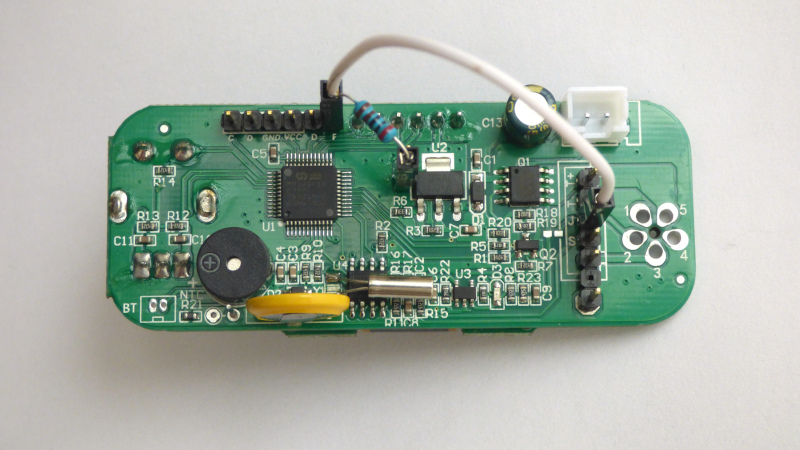

# Custom firmware for T12-958 soldering station

The Quecoo T12-958 / KSGER v2.1S is a T12 soldering station using the MM32SPIN27 Arm processor. These are usage notes. For developers' notes, see [README_DEVELOPER](README_DEVELOPER.md).

## Main screen

The OLED display shows the state of the soldering iron:



The top line of the display shows power supply voltage, setpoint temperature, and cold junction (ambient) temperature.
The middle of the display shows soldering iron tip temperature.
The bottom of the display shows a bar graph of applied heating power.



The soldering station has a rotary encoder with pushbutton.
Turning the knob changes setpoint temperature in steps (default: steps of 5°C). For fine adjustments in steps of 1°C first turn  the knob, then push while turning. The setpoint is displayed in inverted color.

The soldering station has four states: running, boost, standby and sleeping.



When running, a short click of the knob will switch to boost mode. In boost mode, setpoint temperature is increased for a short time. (default: increase of 50°C for 5 minutes)



If the soldering station is inactive, after some time the soldering station goes in standby. (default: 20 minutes of inactivity, standby temperature 200°C).



If the soldering station is inactive even longer, the soldering station goes into sleep mode. (default: 30 minutes of inactivity, heating switched off).



If no T12 tip is detected, a T12 soldering tip is shown. 

A short click will switch the soldering station from running ⇨ boost ⇨ standby ⇨ sleep ⇨ running.



A long press - a second or more - will switch to the menu. The menu allows changing and saving default values.

Here is a [video](https://raw.githubusercontent.com/koendv/t12-958/main/pictures/running_large.mp4) of the soldering station powering up.

## Saving Settings

When changed, the temperature setpoint is saved automatically within 30 seconds. When the soldering station is switched on, the temperature goes back to what it was before the station was switched off.

Other settings have to be saved manually. Go to the "Settings" menu, and choose "Store". Settings are saved in flash, and overwritten when you install new firmware.

## Measuring Cold Junction Temperature

The soldering iron tip contains a thermocouple. The thermocouple gives the temperature difference between soldering iron tip and soldering iron handle. To know the temperature of the soldering iron tip, one has to add the temperature of the soldering iron handle (the cold junction temperature) and the temperature given by the thermocouple.

To measure the temperature in the soldering iron handle, four methods are possible: CPU, NTC on PCB, NTC in handle, and DS18B20.

### CPU Temperature sensor

The microcontroller has an internal temperature sensor.  As the microcontroller heats up during operation, the internal temperature of the microcontroller may be different from the temperature of the cold junction.

### NTC Temperature sensor

A separate document, [README_NTC](README_NTC.md), handles configuring the NTC temperature sensor.

Instead of manually calibrating an analogue temperature sensor it is much more convenient to use factory-calibrated digital sensors.

### DS18B20  Temperature Sensor

The DS18B20 is a digital one-wire temperature sensor. "One-wire" refers to the possibility of powering the sensor, and reading the temperature using only one wire.

#### DS18B20 in handle

For best results, put a DS18B20 in the soldering iron handle. This requires opening the soldering iron handle, removing the NTC and installing a DS18B20 temperature sensor.

 Inside the soldering iron handle, replace the NTC with a DS18B20. Connect DS18B20 VCC and GND to ground (green wire), connect DS18B20 DIO to the white wire (NTC). Colors may differ.

[](pictures/ds18b20_in_handle.jpg)

DS18B20 in soldering iron handle. The DS18B20 has a TO-92 package, like a leaded small-signal transistor.

To avoid short-circuits, cover everything in Kapton tape. Make sure blank metal does not touch other blank metal. Make sure vibration sensor leads do not make contact with temperature sensor leads.

[](pictures/sensors_wrapped.jpg)

The DS18B20 data line needs a pull-up resistor.
 On the PCB, connect the T12 connector pin "J" to pin "F" (pin PB7, UART RX) with a pull-up resistor to 3.3V. Suitable resistor values are 1K - 3.3K. (picture: 2K)

[](pictures/strapped_for_ds18b20.jpg)

In settings, choose SENSOR ONEWIRE.

When one buys a DS18B20, it is not always clear whether the chip is original or generic. To determine the manufacturer, use the "Check ONEWIRE" menu, and look up the sensor family in [this table](https://github.com/cpetrich/counterfeit_DS18B20/#how-do-i-know-if-i-am-affected). Output for the ["Made in Asia"](https://lcsc.com/product-detail/Temperature-Sensors_SENSYLINK-CT1820BZ_C5121991.html) DS18B20 I am using:

```
[1]-Family C SENSYLINK CT1820B
[2] BACK
```
Compared to a Maxim DS18B20, the CT1820B uses less power (30&micro;A, as long as one does not write to EEPROM), and is faster (30ms). Whatever brand you choose, the DS18B20 has to be able to work in parasitic mode.

#### DS18B20 on pcb

If you do not wish to modify the soldering iron handle, you can simply connect a DS18B20 to the pcb pin header. The pin header has ground and 3.3V for the pull-up resistor.

## Downloading firmware

To download firmware, a Segger JLink debugger can be used. The MM32SPIN32 is not directly supported by JLink, but configuring as a MM32L072XX works.

```
JLinkGDBServer -device MM32L072XX -if SWD -speed 1000
```
Some useful commands are in the doc/scripts directory.

Upon delivery, the flash of the processor is read-protected.
When using JLink, the first time firmware is downloaded, type _mon flash erase_ to unlock the device.

```
 $ arm-none-eabi-gdb
(gdb) tar ext :2331
Remote debugging using :2331
warning: No executable has been specified and target does not support
determining executable automatically.  Try using the "file" command.
0xfffffffe in ?? ()
(gdb) mon reset
Resetting target
(gdb) mon halt
(gdb) mon flash erase
Flash erase: O.K.
(gdb) file ~/Arduino/t12-958/build/SeekFree.mm32.MM32SPIN27/t12-958.ino.elf
Reading symbols from ~/Arduino/t12-958/build/SeekFree.mm32.MM32SPIN27/t12-958.ino.elf...
(No debugging symbols found in ~/Arduino/t12-958/build/SeekFree.mm32.MM32SPIN27/t12-958.ino.elf)
(gdb) lo
Loading section .isr_vector, size 0xc0 lma 0x8000000
Loading section .text, size 0xb8a0 lma 0x80000c0
Loading section .rodata, size 0x31e8 lma 0x800bc00
Loading section .ARM, size 0x8 lma 0x800ede8
Loading section .init_array, size 0x34 lma 0x800edf0
Loading section .fini_array, size 0xc lma 0x800ee24
Loading section .data, size 0xd28 lma 0x800ee30
Start address 0x0800888c, load size 63672
Transfer rate: 10363 KB/sec, 7074 bytes/write.
(gdb) mon reset
Resetting target
(gdb) c
Continuing.
^C
Program received signal SIGTRAP, Trace/breakpoint trap.
0x08003952 in Scheduler::execute() ()
(gdb) q
Remote connection closed
 $
```

Alternatives to JLink are e.g. armfly H7-Tool.

## Acknowledgment

This builds upon the work of Jose Barros, [DeividAlfa](https://github.com/deividAlfa/stm32_soldering_iron_controller), [Dreamcat4](https://github.com/dreamcat4/t12-t245-controllers-docs) and many others.

_not truncated_
