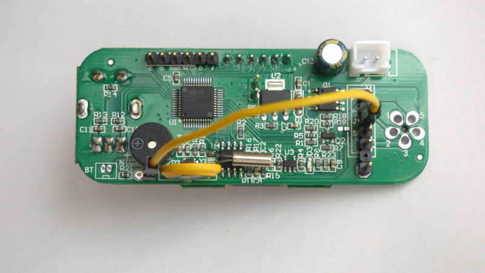

# NTC Sensor

How to connect and calibrate an NTC sensor to the T12-958. An NTC is a resistor with Negative Temperature Coefficient (NTC). The resistance of an NTC becomes lower as temperature increases.

The NTC sensor can be on the PCB or in the soldering iron handle.

### NTC Temperature sensor on PCB

The PCB has a text 'NTC', next to two empty pads. The leftmost pad, next to R21, is connected to ground. The rightmost pad, closest to the battery, is connected to processor pin A5 and a pull-up. This pad is where the processor measures NTC voltage.

To measure temperature using an NTC, two possibilities: NTC on the PCB, or NTC in the soldering iron handle.

To measure PCB temperature, solder a NTC "MF58 10K 3950B" in the  pads marked NTC.  This NTC has 10K resistance at 25°C. In settings, choose "SENSOR NTC". However, PCB temperature is not necessarily the same as the temperature of the cold junction, inside the soldering iron handle.

[](pictures//ntc_on_pcb.jpg)

_NTC in lower left of picture_

## NTC Temperature sensor in handle

The soldering iron handle contains an NTC.

To measure the temperature of the NTC inside the soldering iron handle, connect the NTC pad to the T12 soldering iron connector, pin "J".  In settings, choose "SENSOR NTC".

[](pictures//strapped_for_ntc_in_handle.jpg)

Calibration is necessary to produce reasonable temperature values.

### NTC Calibration

- NTC calibration requires the NTC is used as temperature sensor. In the sensor menu, choose SENSOR NTC.
- Calibration happens at two points. Calibration is in in ADC counts.
- For an NTC, lowest resistance means highest temperature. For the first calibration point, short the NTC.
- Go to "NTC CALIBRATION 1". The first line is the NTC ADC reading, a number from 0 to 4095. The second line is the NTC temperature, as calculated from the NTC ADC reading. Wait until ADC counts settle.  Calibration changes the ADC reading IN1 to the number ADJUST1. For IN1 choose the current ADC count. For ADJUST1 choose 0. This gets rid of any offsets. Disregard the TEMP field for the moment.

```
[1] NTC ADC 121
[2] NTC TEMP 64.0°C
[3]>NTC IN1:120
[4] NTC ADJUST1 0
[5] Back
```

- For the second calibration point choose room temperature. Remove the short of the NTC. With a cold soldering iron, go to "NTC CALIBRATION 2" and wait until ADC counts settle. For IN2 choose the current ADC count. Change ADJUST2 until TEMP is the ambient temperature.

```
[1] NTC ADC 1593
[2] NTC TEMP 27.1°C
[3] NTC IN2 1600
[4]>NTC ADJUST2:2700
```

- As a test, take the NTC between your fingers. Temperature ought to stabilize at 36-37 degrees.
- Finally, save the current settings.

Instead of manually calibrating an analogue temperature sensor it is much more convenient to use factory-calibrated digital sensors.

_not truncated_


